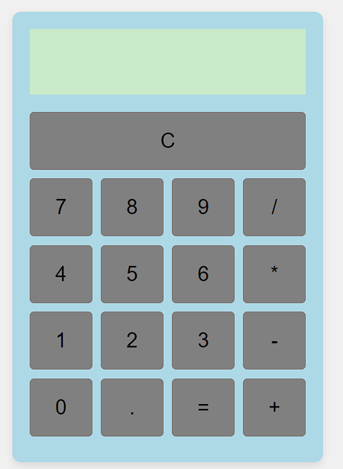

# Calculator Project

This project is a simple yet functional calculator application built with HTML, CSS, and JavaScript. It performs basic arithmetic operations and provides a user-friendly interface for performing calculations.

## Table of Contents

- [Features](#features)
- [Technologies Used](#technologies-used)
- [Project Structure](#project-structure)
- [Code Overview](#code-overview)
- [Limitations](#known-issues)
- [Future Improvements](#future-improvements)

## Features

- **Basic Arithmetic Operations:** Supports addition, subtraction, multiplication, and division.
- **Clear Button:** Resets the calculator's display to allow for new calculations.
- **Error Handling:** Displays 'error' for invalid operations such as starting with an operator or using the '=' button with incomplete input.

## Languages and Tools Used

- **HTML:** Defines the structure of the calculator.
- **CSS:** Styles the calculator's appearance, including layout and button design.
- **JavaScript:** Implements the calculator's functionality, including input handling and arithmetic operations.

## Project Structure

The project consists of the following files:

- `index.html`: Contains the HTML structure of the calculator.
- `style.css`: Provides styles for the calculator's layout and design.
- `main.js`: Contains JavaScript code for handling user interactions and performing calculations.

## Code Overview

### HTML

- Defines the layout of the calculator, including the display area and buttons.
- Utilizes semantic elements to structure the interface effectively.

### CSS

- **Styling:** Adds colors, padding, borders, and shadows to enhance the visual appeal.
- **Responsiveness:** Ensures that the calculator is centered and adjusts to various screen sizes.

### JavaScript

- **Event Listeners:** Attach to buttons to handle clicks and update the display.
- **Input Parsing:** Handles user input, including number and operator input.
- **Calculation Logic:** Processes arithmetic operations and displays results or errors as needed.

## Limitations

- **Complex Expressions:** The calculator does not support parentheses or more complex expressions beyond basic arithmetic operations.

## Future Improvements

- **Enhanced Error Handling:** Provide more informative error messages and better handling of edge cases.
- **Support for Complex Expressions:** Implement functionality to handle parentheses and additional mathematical operations.

## Project Snapshot

 A preview of the calculator:

